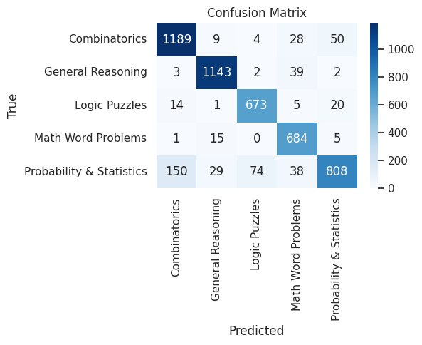

# **Reasoning-Questions-Classification**
Hybrid symbolic-neural model combining DistilBERT + TF-IDF + Logistic Regression for reasoning question classification.

Reasoning Question Classification

This project is about teaching a computer to understand and classify **reasoning questions**.  
Questions can belong to different types, such as:

- Combinatorics (counting problems)
- Probability & Statistics
- Logic Puzzles
- Math Word Problems
- General Reasoning


What I Did in the project?
- Used a **hybrid approach** → combined simple rules + machine learning + deep learning.
- Machine Learning: TF-IDF with Logistic Regression, Random Forest, SVM, XGBoost.
- Deep Learning: DistilBERT (a transformer model).
- Compared the models and then built a **hybrid model** for better accuracy.


📊 Dataset
- Source: [Open-Platypus Logical Reasoning Dataset (Kaggle)](https://www.kaggle.com/datasets/thedevastator/open-platypus-logical-reasoning)  
- Cleaned and prepared before training (tokenization, balancing, etc.).


 How to Run
1. Install the requirements:
   ```bash
   pip install -r requirements.txt


   ---

## Results

### Confusion Matrix


### Per-Class F1 Scores


---

##  Key Takeaway
The hybrid model reached around **90% accuracy**, giving strong performance across all reasoning categories, including tricky ones like Logic Puzzles and Probability.


